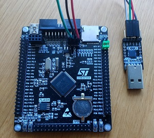

### Cheap TRNG

So lately I had the need to generate a bunch of crypto currency wallets. Being crypto-paranoid,
I wanted to do this on an air-gapped, live-CD machine with no disk/storage attached - so basically
the worst setup for getting good entropy. I looked around for hardware TRNGs and there are a bunch,
but they cost more than I was willing to pay. There had to be a cheaper way...

It turns out the STM32F4 family of microcontrollers contains a TRNG and I already had this board
that I bought on eBay for another project. It costs around 10 euro, just search for
"stm32f407 development board". You'll also need a usb-serial converter (CP2012 on pic) to get the
random numbers from the MCU to the PC and also to flash the chip.

[](images/trng.jpg)

I took the serial interface code from my STM32F10x library, simplified and modified it to work with
F407 and wrote the TRNG peripheral bit.

To flash the board in linux, you need stm32flash. If you have a Windows machine, you can use the
"STM32 Flash loader demonstrator (UM0462) " from ST. Set BT0 jumper to 3V3 and BT1 to GND and reset
the board. This puts the chip into serial bootloader mode.

```
apt-get install stm32flash
stm32flash -w main.hex -v /dev/ttyUSB0
```

Set BT0 jumper back to GND and reset the board. This boots the chip normally, i.e. from the code
we just flashed.

```
stty -F /dev/ttyUSB0 raw 115200
cat /dev/ttyUSB0
```

You should now see the MCU spewing random bytes. We need to test the quality of the randomness
before we can trust it and for that, we need to gather a lot of random data to do the tests on.

```
cat /dev/ttyUSB0 >> trng.bin
```

Let this run for a few hours. Gather at least 200 MBytes. After that, we're ready to test with
[dieharder](http://www.phy.duke.edu/~rgb/General/dieharder.php).

```
apt-get install dieharder
dieharder -g 201 -f trng.bin -a
```

Most of the tests should pass. If a test fails and dieharder did a lot of rewinding during the test, that
could be the reason. Basically if dieharder runs out of randomness (reaches EOF) for a particular test,
it rewinds the file and rereads the same randomness again. Obviously not ideal. You need to decide whether
you're content with most of the tests passing and some tests failing or you can add more randomness to
the file and try again.

When you're ready to use the board as a source of entropy for linux, run rngd.

```
apt-get install rngd
sudo rngd -f -r /dev/ttyUSB0
```

This invokes the rng daemon in the foreground (i.e. one time) as opposed to it being a service. If you want to
have it persist through reboots, you'll have to write a configuration file which is out of scope here.
After a few minutes, there should be plenty of entropy available for crypto key generation.

```
cat /proc/sys/kernel/random/entropy_avail
```

On the other hand, you can omit all this crazyness by having the machine connected to the internet and just
browsing for an hour (maybe play some [TypeRacer](http://play.typeracer.com/) games), then disconnecting the
network cable and generating the keys. But where's the fun in that right? :)

In conclusion - while this was a fun journey for me (and it very likely works), common sense dictates that if
you're planning to use this to safeguard a large investment, maybe going cheap is not the way to go. And ofcourse,
do your own research.

Good luck!
